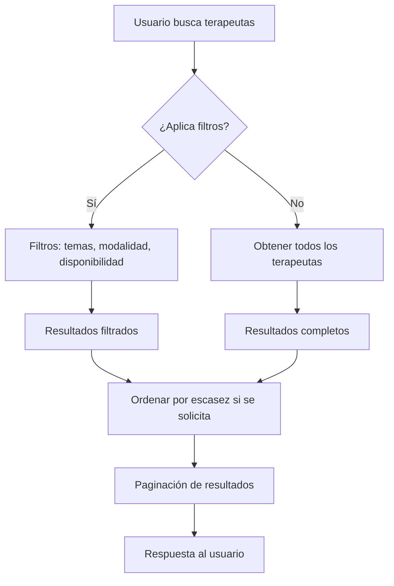
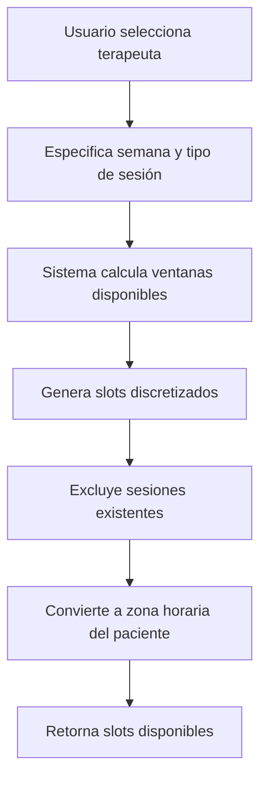
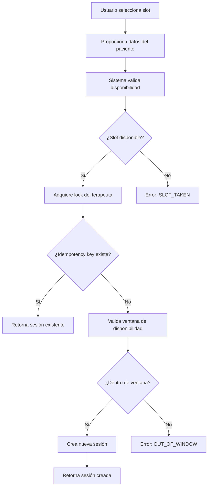
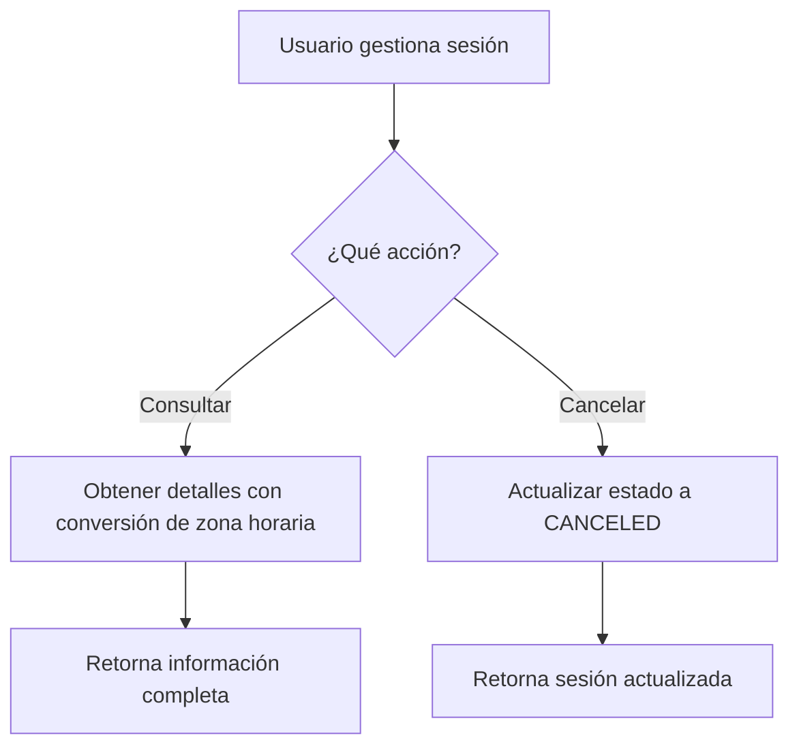

# Documento Funcional - Sistema de Reservas Psicológicas

## 📋 Índice

1. [Descripción General](#descripción-general)
2. [Funcionalidades Principales](#funcionalidades-principales)
3. [Flujos de Usuario](#flujos-de-usuario)
4. [Gestión de Terapeutas](#gestión-de-terapeutas)
5. [Gestión de Sesiones](#gestión-de-sesiones)
6. [Sistema de Disponibilidad](#sistema-de-disponibilidad)
7. [Gestión de Temas](#gestión-de-temas)
8. [Jobs Periódicos](#jobs-periódicos)
9. [Características Técnicas](#características-técnicas)
10. [Casos de Uso](#casos-de-uso)

---

## 🎯 Descripción General

El **Sistema de Reservas Psicológicas** es una API RESTful desarrollada en NestJS que permite gestionar reservas de sesiones psicológicas de manera eficiente y confiable. El sistema maneja terapeutas, pacientes, sesiones, disponibilidad y temas de especialización.

### **Objetivos del Sistema:**

- ✅ Gestionar terapeutas y sus especialidades
- ✅ Manejar disponibilidad y reservas de sesiones
- ✅ Proporcionar filtros avanzados para búsqueda
- ✅ Garantizar idempotencia en las operaciones
- ✅ Control de concurrencia para evitar conflictos
- ✅ Gestión automática de sesiones expiradas

---

## 🚀 Funcionalidades Principales

### **1. Gestión de Terapeutas**

- **Registro y consulta** de terapeutas con información completa
- **Especialidades múltiples** por terapeuta
- **Modalidades de sesión** (online/presencial)
- **Zonas horarias** personalizadas por terapeuta
- **Filtros avanzados** por temas, modalidad y disponibilidad

### **2. Gestión de Sesiones**

- **Creación de reservas** con validación de disponibilidad
- **Idempotencia** garantizada mediante claves únicas
- **Control de concurrencia** con locks a nivel de terapeuta
- **Cancelación de sesiones** (idempotente)
- **Conversión automática** de zonas horarias

### **3. Sistema de Disponibilidad**

- **Ventanas de disponibilidad** configurables por terapeuta
- **Cálculo automático** de slots disponibles
- **Discretización** en intervalos configurables
- **Detección de conflictos** con sesiones existentes
- **Ordenamiento por escasez** de disponibilidad

### **4. Gestión de Temas**

- **Catálogo de temas** de especialización
- **Relaciones muchos a muchos** con terapeutas
- **Filtros por temas** con lógica OR/AND

### **5. Jobs Periódicos**

- **Cancelación automática** de sesiones expiradas
- **Ejecución cada 5 minutos**
- **Logging detallado** de operaciones

---

## 🔄 Flujos de Usuario

### **Flujo 1: Búsqueda y Filtrado de Terapeutas**



**Qué se puede hacer:**

- ✅ Buscar terapeutas sin filtros
- ✅ Filtrar por temas específicos (OR/AND logic)
- ✅ Filtrar por modalidad (online/presencial)
- ✅ Calcular disponibilidad en tiempo real
- ✅ Ordenar por escasez de slots disponibles
- ✅ Paginar resultados

### **Flujo 2: Consulta de Disponibilidad**



**Qué se puede hacer:**

- ✅ Consultar disponibilidad por semana
- ✅ Especificar tipo de sesión (duración, modalidad)
- ✅ Obtener slots en zona horaria del paciente
- ✅ Configurar paso de discretización (15min por defecto)

### **Flujo 3: Creación de Reserva**



**Qué se puede hacer:**

- ✅ Crear reserva con datos completos del paciente
- ✅ Validar disponibilidad en tiempo real
- ✅ Garantizar idempotencia con claves únicas
- ✅ Control de concurrencia por terapeuta
- ✅ Validación de ventanas de disponibilidad

### **Flujo 4: Gestión de Sesiones**



**Qué se puede hacer:**

- ✅ Consultar detalles de sesión
- ✅ Ver horarios en zona horaria del paciente
- ✅ Cancelar sesión (idempotente)
- ✅ Obtener información del tipo de sesión

---

## 👨‍⚕️ Gestión de Terapeutas

### **Estructura de Datos:**

```typescript
Therapist {
  id: string
  name: string
  timezone: string
  sessionTypes: SessionType[]
  therapistTopics: TherapistTopic[]
  modalities: ('online' | 'in_person')[]
  availabilitySummary?: { freeSlotsCount: number }
}
```

### **Operaciones Disponibles:**

#### **1. Listar Terapeutas**

```bash
GET /therapists
```

**Filtros disponibles:**

- `topicIds`: IDs de temas (separados por coma)
- `requireAll`: true/false (lógica AND/OR para temas)
- `modality`: 'online' | 'in_person'
- `limit`: número de resultados
- `offset`: paginación
- `weekStart`: fecha para cálculo de disponibilidad
- `sessionTypeId`: tipo de sesión para disponibilidad
- `stepMin`: paso de discretización
- `orderBy`: 'scarcity' para ordenar por disponibilidad

#### **2. Obtener Terapeuta Específico**

```bash
GET /therapists/:id
```

#### **3. Tipos de Sesión del Terapeuta**

```bash
GET /therapists/:id/session-types
```

#### **4. Disponibilidad del Terapeuta**

```bash
GET /therapists/:id/availability?weekStart=YYYY-MM-DD&sessionTypeId=xxx&patientTz=xxx&stepMin=15
```

---

## 📅 Gestión de Sesiones

### **Estructura de Datos:**

```typescript
Session {
  id: string
  therapistId: string
  sessionTypeId: string
  startUtc: string
  endUtc: string
  patientId: string
  patientName: string
  patientEmail: string
  patientTz: string
  status: 'PENDING' | 'CONFIRMED' | 'CANCELED'
  idempotencyKey: string
  createdAt: Date
  canceledAt?: Date
  startInPatientTz: string
  endInPatientTz: string
}
```

### **Operaciones Disponibles:**

#### **1. Crear Sesión**

```bash
POST /sessions
Headers: Idempotency-Key: <uuid>
Body: {
  therapistId: string
  sessionTypeId: string
  startUtc: string
  patientId: string
  patientName: string
  patientEmail: string
  patientTz: string
}
```

**Validaciones:**

- ✅ Slot disponible (sin conflictos)
- ✅ Dentro de ventana de disponibilidad
- ✅ Idempotencia garantizada
- ✅ Control de concurrencia

#### **2. Consultar Sesión**

```bash
GET /sessions/:id
```

**Respuesta incluye:**

- ✅ Datos completos de la sesión
- ✅ Horarios en zona horaria del paciente
- ✅ Información del tipo de sesión

#### **3. Cancelar Sesión**

```bash
PATCH /sessions/:id/cancel
```

**Características:**

- ✅ Idempotente (no falla si ya está cancelada)
- ✅ Actualiza `status` y `canceledAt`
- ✅ Retorna sesión actualizada

---

## ⏰ Sistema de Disponibilidad

### **Componentes:**

#### **1. AvailabilityWindow**

```typescript
{
  therapistId: string;
  weekday: number(0 - 6);
  startMin: number(0 - 1439);
  endMin: number(0 - 1439);
  modality: 'online' | 'in_person';
  weekStart: string(YYYY - MM - DD);
}
```

#### **2. Cálculo de Slots**

- **Entrada:** semana, tipo de sesión, zona horaria
- **Proceso:**
  1. Obtener ventanas de disponibilidad
  2. Generar fechas concretas
  3. Discretizar en intervalos
  4. Excluir sesiones existentes
  5. Convertir a zona horaria del paciente

#### **3. Respuesta de Disponibilidad**

```typescript
{
  availability: {
    "2025-01-27": [
      {
        startUtc: "2025-01-27T14:00:00Z",
        endUtc: "2025-01-27T15:00:00Z",
        startInPatientTz: "2025-01-27T11:00:00-03:00",
        endInPatientTz: "2025-01-27T12:00:00-03:00",
        bookableStarts: [
          "2025-01-27T14:00:00Z",
          "2025-01-27T14:15:00Z",
          // ...
        ]
      }
    ]
  }
}
```

---

## 🏷️ Gestión de Temas

### **Estructura:**

```typescript
Topic {
  id: string
  name: string
  description: string
}
```

### **Operaciones:**

```bash
GET /topics
```

### **Filtros en Terapeutas:**

- **Lógica OR:** `topicIds=anxiety,depression` (terapeutas con CUALQUIERA de los temas)
- **Lógica AND:** `topicIds=anxiety,depression&requireAll=true` (terapeutas con TODOS los temas)

---

## ⏰ Jobs Periódicos

### **Cancelación Automática de Sesiones Expiradas**

**Configuración:**

- ✅ Ejecución cada 5 minutos
- ✅ Busca sesiones `PENDING` con `startUtc < now()`
- ✅ Actualiza a `CANCELED` con `canceledAt = now()`
- ✅ Logging detallado de operaciones

**Logs generados:**

```
[JobsService] Starting job to cancel expired pending sessions...
[JobsService] Successfully canceled 2 expired pending sessions
[JobsService] Canceled session session-1 for patient Lucas (scheduled for 2025-01-29T19:00:00Z)
```

---

## 🔧 Características Técnicas

### **1. Idempotencia**

- ✅ Claves únicas para operaciones críticas
- ✅ Detección de operaciones duplicadas
- ✅ Respuestas consistentes

### **2. Control de Concurrencia**

- ✅ Locks a nivel de terapeuta
- ✅ Uso de `pg_advisory_xact_lock`
- ✅ Prevención de conflictos de reservas

### **3. Manejo de Zonas Horarias**

- ✅ Conversión automática UTC ↔ zona local
- ✅ Soporte para DST (Daylight Saving Time)
- ✅ Formateo para respuestas de API

### **4. Validaciones**

- ✅ Datos de entrada con class-validator
- ✅ Transformación automática de tipos
- ✅ Manejo de errores consistente

### **5. Testing**

- ✅ 130+ tests unitarios
- ✅ Cobertura de casos edge
- ✅ Mocks para servicios externos

---

## 🎯 Casos de Uso

### **Caso 1: Paciente busca terapeuta para ansiedad**

1. **Búsqueda inicial:**

   ```bash
   GET /therapists?topicIds=anxiety&modality=online
   ```

2. **Consulta de disponibilidad:**

   ```bash
   GET /therapists/:id/availability?weekStart=2025-01-27&sessionTypeId=st1&patientTz=America/Argentina/Buenos_Aires
   ```

3. **Creación de reserva:**
   ```bash
   POST /sessions
   {
     "therapistId": "t1",
     "sessionTypeId": "st1",
     "startUtc": "2025-01-29T20:00:00Z",
     "patientId": "user123",
     "patientName": "María",
     "patientEmail": "maria@email.com",
     "patientTz": "America/Argentina/Buenos_Aires"
   }
   ```

### **Caso 2: Administrador monitorea disponibilidad**

1. **Lista ordenada por escasez:**

   ```bash
   GET /therapists?weekStart=2025-01-27&sessionTypeId=st1&orderBy=scarcity
   ```

2. **Filtros combinados:**
   ```bash
   GET /therapists?topicIds=depression,anxiety&modality=online&limit=10&offset=0
   ```

### **Caso 3: Cancelación de sesión**

1. **Consulta de sesión:**

   ```bash
   GET /sessions/:id
   ```

2. **Cancelación:**
   ```bash
   PATCH /sessions/:id/cancel
   ```

### **Caso 4: Gestión automática**

- ✅ Sistema cancela automáticamente sesiones expiradas
- ✅ Logs detallados para auditoría
- ✅ No requiere intervención manual

---

## 📊 Métricas y Monitoreo

### **Logs Disponibles:**

- ✅ Requests HTTP con timing
- ✅ Operaciones de base de datos
- ✅ Jobs periódicos con estadísticas
- ✅ Errores con stack traces

### **Endpoints de Monitoreo:**

```bash
GET /health          # Estado del servicio
GET /therapists      # Métricas de terapeutas
GET /sessions        # Métricas de sesiones
```

---

## 🔒 Seguridad y Validaciones

### **Validaciones de Entrada:**

- ✅ UUIDs válidos para IDs
- ✅ Zonas horarias válidas
- ✅ Emails con formato correcto
- ✅ Fechas en formato ISO 8601

### **Manejo de Errores:**

- ✅ Códigos HTTP apropiados
- ✅ Mensajes de error descriptivos
- ✅ Logging de errores para debugging

### **Idempotencia:**

- ✅ Prevención de reservas duplicadas
- ✅ Claves únicas por operación
- ✅ Respuestas consistentes

---

## 🚀 Deployment y Configuración

### **Variables de Entorno:**

```bash
DATABASE_URL=postgresql://...
PORT=3000
NODE_ENV=development
```

### **Comandos Disponibles:**

```bash
npm run start:dev    # Desarrollo
npm run build        # Compilación
npm run test         # Tests unitarios
npm run db:seed      # Poblar base de datos
npm run db:migrate   # Ejecutar migraciones
```

---

## 📈 Roadmap Futuro

### **Funcionalidades Planificadas:**

- 🔄 Notificaciones por email
- 🔄 Calendario integrado
- 🔄 Pagos online
- 🔄 Reportes avanzados
- 🔄 API para aplicaciones móviles
- 🔄 Webhooks para integraciones

### **Mejoras Técnicas:**

- 🔄 Cache Redis para disponibilidad
- 🔄 Rate limiting
- 🔄 Autenticación JWT
- 🔄 Documentación OpenAPI mejorada
- 🔄 Métricas con Prometheus

---

_Documento actualizado: 31/07/2025_
_Versión del sistema: 1.0.0_
